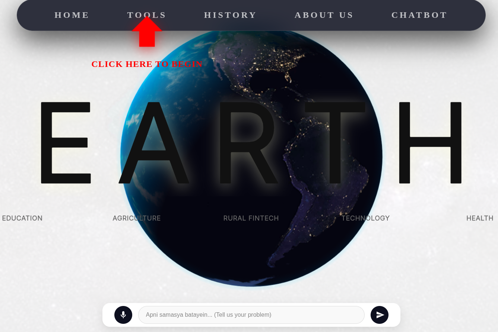

# EARTH

### [Watch on YouTube](https://youtu.be/fKmbCSz-TNw?si=HE3-jUb1b5VzPD8a)

## Inspiration
Over **900 million people** live in rural India, yet most crop advisory tools target urban populations, creating significant barriers for underprivileged individuals. Many students in rural areas struggle to understand textbooks in their native languages. According to NFHS-5, 36% of women and 29% of men lack awareness of basic health indicators, leading to uncertainty about when to seek medical care.

Furthermore, 70% of rural youth are unemployed, and 40% of female youth are unaware of livelihood opportunities. Educational gaps are stark: only 23.4% of Standard III students can read at a Standard II level. Safety is also a major concern, with 40% of women feeling unsafe and two-thirds of harassment incidents going unreported. Farmers frequently fall victim to loan scams and face 30-45% yield gaps due to limited access to modern agricultural knowledge.

## What it does
**EARTH** is a voice-first application providing access to four specialized tools:

*   **Swasth Raho (Health):** Includes a "Medicine Label Reader" for the illiterate, a "Doctor Visit Explainer" to clarify medical advice, and a "Symptom Checker" for basic diagnosis.
*   **Pustak Dost (Education):** Features a "Textbook Simplifier" for English content, a "Career Roadmap" for youth, and a "Scheme and Job Finder."
*   **Kisan Rath (Agriculture):** Provides a "Crop Disease Detector," a "Loan Document Reader" to identify predatory lending traps, and a "Government Schemes" portal.
*   **Shakti (Women's Empowerment):** Offers "Know Your Rights" guidance, "Scholarships and Schemes" access, and a comprehensive "Women's Help Guide."
*   **AI Chatbot:** A universal assistant to answer any additional questions.

## How we built it
The project was a collaborative effort between front-end and back-end development. We used **Featherless AI** as the core intelligence engine. Development involved managing separate branches to minimize conflicts, though final integration required significant coordination to resolve overlapping logic.

## Challenges we ran into
Operating remotely required daily sync meetings via Discord to maintain alignment. This project marked a significant scale-up in our experience with API integration. Balancing hackathon deadlines with academic commitments proved challenging, requiring intense "sprints" to stay on schedule.

## Accomplishments that we're proud of
We are proud to have built a tool that addresses the specific, multi-faceted needs of rural families—from agricultural support for parents to educational assistance for children.

## What we learned
We gained invaluable experience in synchronized remote teamwork, project management under tight deadlines, and the collective effort required to bring a complex vision to life.

## What's next for EARTH
To scale for a real-world launch, we plan to deploy local **Llama servers** in rural areas to minimize API costs and ensure the application remains free for all users.

## Built With
*   **Frontend:** React, Vite, TypeScript, CSS3, Spline
*   **Backend:** Node.js, Express.js, MongoDB, Mongoose, REST API
*   **AI & Processing:** Featherless AI, Deepgram, Google TTS, Tesseract.js
*   **Security & Testing:** JWT, Multer, Supertest

